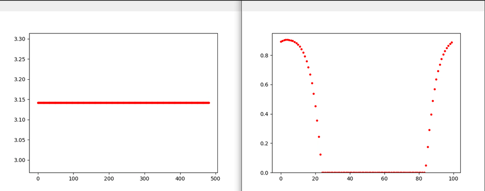
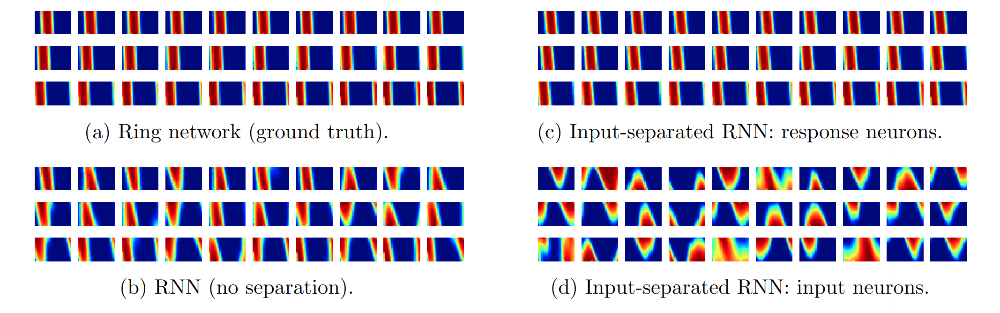
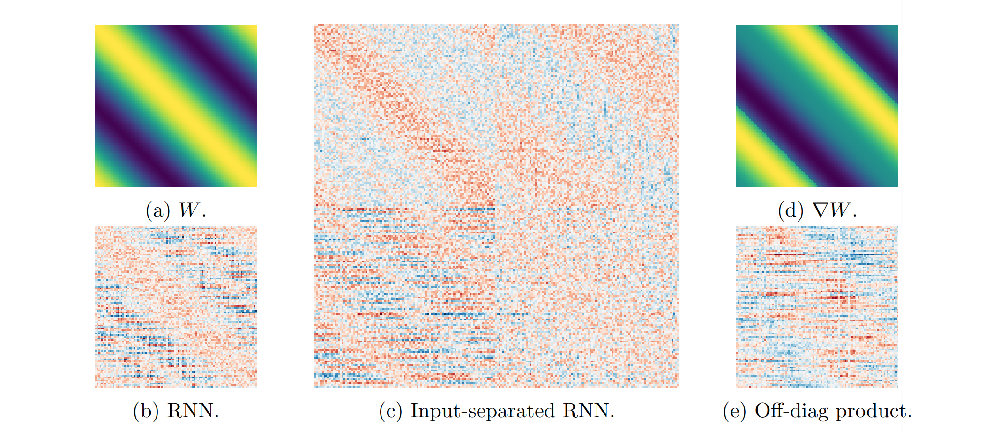

# Neural System Identification by Training Recurrent Neural Networks

## Introduction
Neural connectivities are critical in computational modeling but hard to measure in experiments. Can we infer the neural connectivities given the neural activity data? The problem can be modeled as a system identification process, thus, estimating parameters based on the input-response pairs. 

The key barrier is that for the recorded neural responses, their relationships with the external inputs are usually obscure. In this work, we propose to use input-separated recurrent neural networks (RNNs) to solve the problem.
We illustrate the effectiveness of our method by identifying a ring attractor network, which is the theoretical model of the drosophila head-direction (HD) system.

## Requirements
To install dependancies
```
pip install -r requirements.txt
```

## Data Collection: Ring Attractor Model
To simulate a ring attractor model and collect the firing rates data, run
```
python cann.py
```
and data will be stored in the folder [data](./data). You could turn ```visualize=True``` to visualize the continuous attractor activity.



## Model Training
To train a RNN model fitting the simulated data, run the script
```
sh train.sh
```
you may want to register for the [W & B service](wandb.ai) to log the training process. 

## Results Visualization
To visualize the neural system identification results, check the jupyter notebook in [test.ipynb](./test.ipynb).

* Tuning curves.



* Connectivity matrix.



# Conclusion
Experiments show that:

* Input-separated RNN successfully identifies the structure of the connectivity matrix.
* Without input separation, the RNN identifies a mixture of compass and shifter neurons, thus fails to genuinely reconstruct the network.
 * Shifter neurons automatically emerge within the input/hidden neurons, even only the compass neurons are observed during training.

 In all, our results imply two constraints are effective in neural system identification---a neural activity constraint determining the response-response connectivity (attractors in working memory) and a neural dynamics constraint determining the input-response connectivity (transformations between the attractor states). 
 
 Future directions include identifying neural systems with higher-order input-response relations, mutual inference between input and response neurons, and application to actual physiology data, especially examining the 2D continuous attractor model of the grid cell system.